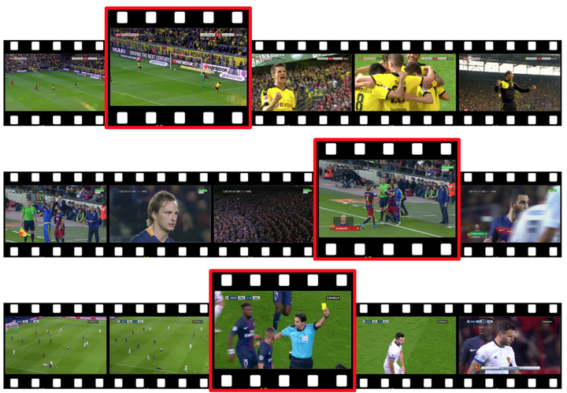

# Highlight Retrieval

This repository contains the inference code to spot highlight moments in soccer games.

The task is to spot 17 types of actions (goals, corners, fouls, ...) in untrimmed broadcast soccer videos. To do so, a custom loss function is used to explicitly model the temporal context around action spots. The main idea behind this loss is to penalize the frames far-distant from the action and steadily decrease the penalty for the frames gradually closer to the action. The frames just before the action are not penalized to avoid providing misleading information as its occurrence is uncertain. However, those just after the action are heavily penalized as we know for sure that the action has occurred.

<p align="center"></p>

For more information about the method, check out our [presentation video](https://www.youtube.com/watch?v=51cyRDcmO00).
</a>


## Getting Started

The following instructions will help you install the required libraries and the dataset to run the code. The code runs in <code>python 3</code> and was tested in a conda environment. Pytorch is used as deep learning library with CUDA 10.1. 


### Create environment

To create and setup the conda environment, simply follow the following steps:

```bash
conda create -n highlight python=3.8
conda activate highlight
conda install pytorch=1.6 torchvision=0.7 cudatoolkit=10.1 -c pytorch
apt-get install ffmpeg
pip install scikit-video==1.1.11 tensorflow==2.3.0 imutils opencv-python==3.4.11.41 SoccerNet moviepy==1.0.3 scikit-learn==0.24.2 ffmpy
```


## Inference on an external video

Run the code using:
```
python main.py --video_path=<path to your video>
```

This will produce 17 temporal images of predictions (one per class, only predictions with confidence scores above 0.34) and a json file containing all predictions in <code>inference/outputs</code>.
